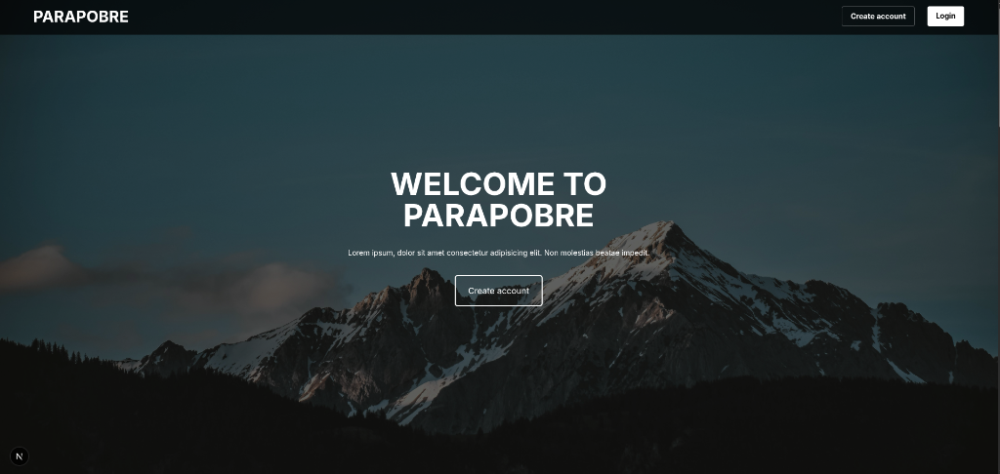
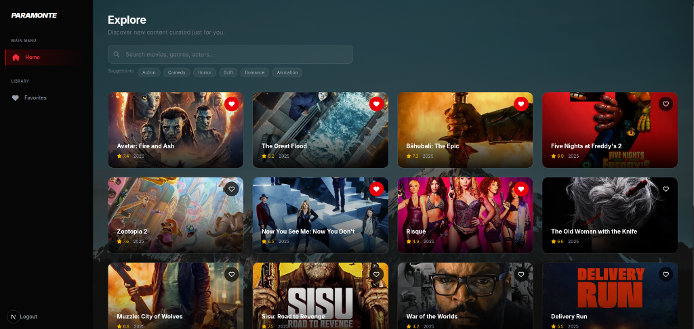
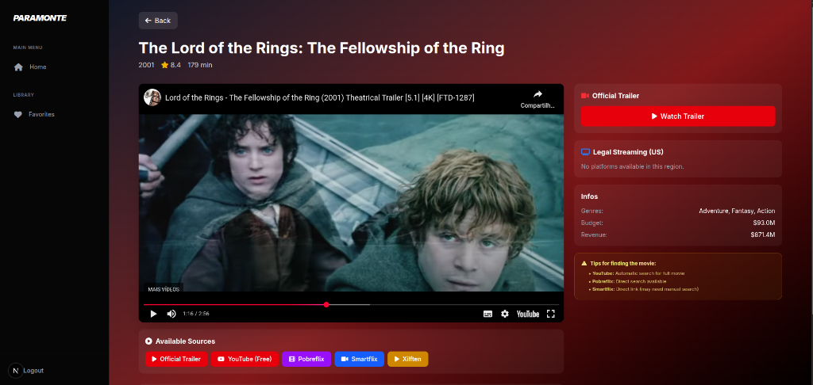

# Parapobre

<div align="center">
  
  
  ### Modern Movie Streaming Dashboard & Discovery Platform
  
  [](https://nextjs.org/)
  [](https://react.dev/)
  [](https://tailwindcss.com/)
  [](LICENSE)
  []()
</div>

---

## � Table of Contents

- [Overview](#overview)
- [Tech Stack](#tech-stack)
- [Key Features](#key-features)
- [Screenshots](#screenshots)
- [Installation](#installation)
- [Configuration](#configuration)
- [Contributing](#contributing)
- [License](#license)

---

## Overview

**Parapobre** is a cutting-edge movie discovery client built for the modern web. It leverages the power of the **TMDB API** to provide real-time trending content, comprehensive movie details, and an immersive playback interface. Designed with performance and aesthetics in mind, it offers a seamless "Netflix-like" experience directly in the browser.

### Key Benefits

- **⚡ Zero Latency Navigation**: Instant page transitions powered by Next.js routing.
- **🎨 Premium UI/UX**: Cinematic dark mode interface with glassmorphism effects.
- **� Fully Responsive**: Optimized for desktops, tablets, and mobile devices.
- **🔒 Privacy Focused**: No user tracking or external analytics.

---

## Tech Stack

<div align="center">
  
| Core Framework | Styling & UI | Logic & Data |
|:--------------:|:------------:|:------------:|
|  |  |  |
|  |  |  |

</div>

---

## Key Features

### 🎬 Discovery & Playback
<table>
<tr>
<th width="30%">Feature</th>
<th width="70%">Description</th>
</tr>
<tr>
<td><strong>🔥 Trending Now</strong></td>
<td>Real-time feed of the most popular movies worldwide.</td>
</tr>
<tr>
<td><strong>🔍 Smart Search</strong></td>
<td>Instant search for movies, actors, and genres with debounced input.</td>
</tr>
<tr>
<td><strong>▶️ Multi-Source Player</strong></td>
<td>Watch official trailers or find streaming providers (YouTube, Pobreflix, Smartflix).</td>
</tr>
<tr>
<td><strong>📱 Responsive Layout</strong></td>
<td>Adaptive grid system that looks great on 4k screens or mobile phones.</td>
</tr>
</table>

### 👤 User Library
<table>
<tr>
<th width="30%">Feature</th>
<th width="70%">Description</th>
</tr>
<tr>
<td><strong>❤️ Favorites System</strong></td>
<td>One-click save to your personal library (Local Storage persistence).</td>
</tr>
<tr>
<td><strong>�️ Genre Filtering</strong></td>
<td>Quickly filter content by categories like Action, Horror, Comedy, etc.</td>
</tr>
<tr>
<td><strong>ℹ️ Rich Metadata</strong></td>
<td>Detailed views with ratings, runtime, release year, and synopsis.</td>
</tr>
</table>

---

## Screenshots

<div align="center">
  
  <p><em>Browse an extensive catalog of trending movies with real-time search.</em></p>
  
  <br/>
  
  
  <p><em>Immersive player interface with trailer integration and streaming sources.</em></p>
</div>

---

## Installation

### System Requirements

| Component | Minimum Requirement |
|:-----------|:-----------------|
| Node.js | Version 18.0 or higher |
| Package Manager | NPM or Yarn |
| API Key | TMDB Account (Free) |

### Setup Guide

1. **Clone the repository**
   ```bash
   git clone https://github.com/Kiuzo/Parapobre.git
   cd Parapobre
   ```

2. **Install dependencies**
   ```bash
   npm install
   ```

3. **Configure Environment**
   Create a `.env.local` file in the root directory:
   ```env
   NEXT_PUBLIC_TMDB_API_KEY=your_tmdb_api_key_here
   ```

4. **Start Development Server**
   ```bash
   npm run dev
   ```
   Access the app at `http://localhost:3000`

---


## License

Distributed under the MIT License. See `LICENSE` for more information.

<div align="center">
  
[](https://opensource.org/licenses/MIT)

</div>

---

<div align="center">
  <p><strong>© 2025 Parapobre Project</strong></p>
  <p>by <a href="https://github.com/Kiuzo">Kiuzo</a></p>
  
  <br>
  
  <table align="center">
  <tr>
    <td align="center">
      <a href="https://github.com/kiuzo">
        <br>
        <sub>
          <b>Kiuzo</b>
        </sub>
      </a>
      <br>
      <sub>Full Stack Developer</sub>
    </td>
  </tr>
</table>
  
</div>
